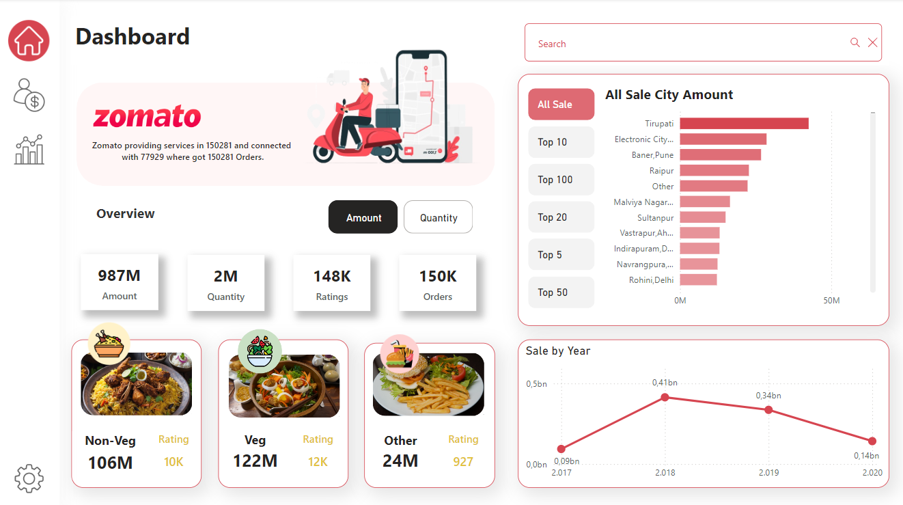
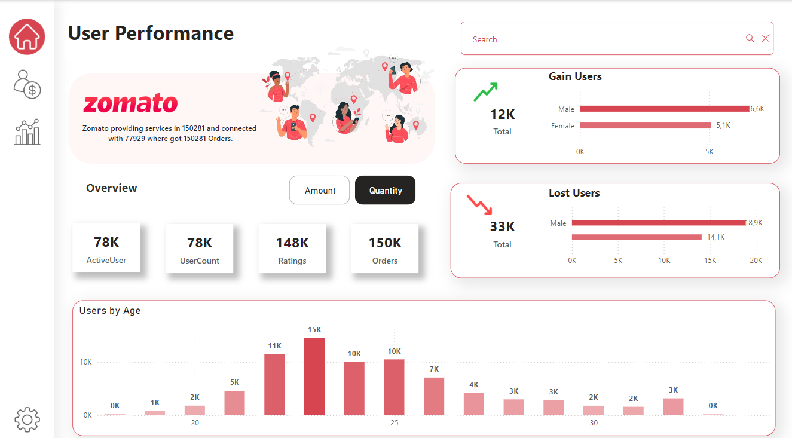
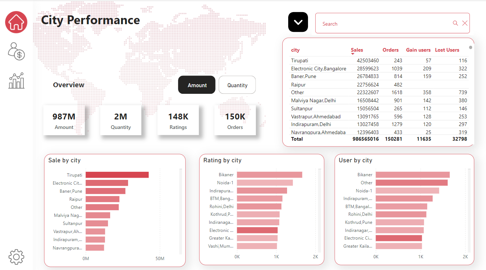

# Zomato Sales Dashboard Visualization with Power BI

Welcome to the Zomato Sales Dashboard Visualization project! This repository contains a Power BI project designed to visualize data related to Zomato's sales performance, user activity, and city-wise analysis.

## Overview

The Zomato Sales Dashboard Visualization project aims to provide insights into various aspects of Zomato's operations, including sales amounts, order quantities, user engagement, and city performance. By leveraging Power BI's interactive features, users can explore and analyze Zomato's data in a visually appealing and intuitive manner.

## Features

- Interactive Dashboards: Explore Zomato's data through interactive dashboards and visualizations.
Sales Analysis: Visualize sales data, order quantities, and revenue trends.
- User Engagement Analysis: Analyze user engagement metrics such as active users, user counts, and gender-based user gains and losses.
- City Performance: Track sales performance, user ratings, and order quantities across different cities.
- Revenue Trends: Examine revenue trends by year and city to identify growth patterns and areas of improvement.

## Power BI Pages

### Overview

This page provides a high-level overview of Zomato's operations. Key metrics displayed include the total sales amount, order quantities, ratings, and orders. Visualizations such as the top cities by sales amount and a year-wise sales trend graph provide quick insights into Zomato's performance.

### User Performance

This page focuses on user engagement and activity. Key metrics displayed include the number of active users, total user count, ratings, and orders. Visualizations include a breakdown of user gains and losses by gender, and an age-wise distribution of users, providing insights into user demographics and engagement trends.

### City Performance

This page provides a detailed analysis of Zomato's performance across different cities. Key metrics displayed include sales amount, order quantities, ratings, and user counts. Visualizations such as sales by city, ratings by city, and user counts by city help identify top-performing regions and areas for improvement.

By utilizing these interactive dashboards, users can gain comprehensive insights into Zomato's operations and make data-driven decisions to enhance performance and growth.